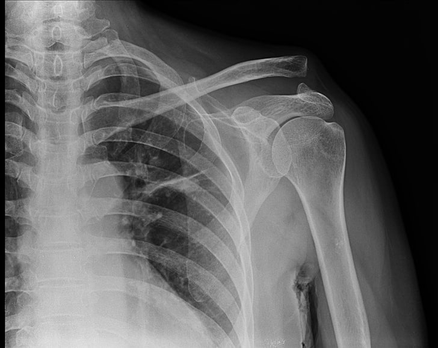

<a name="readme-top"></a>

<!-- PROJECT LOGO -->
# Parallel Image Enhancement

<!-- TABLE OF CONTENTS -->
<details>
  <summary>Table of Contents</summary>
  <ol>
    <li>
      <a href="#about-the-project">About The Project</a>
      <a href="#examples">Examples</a>
      <ul>
        <li><a href="#built-with">Built With</a></li>
      </ul>
    </li>
    <li>
      <a href="#getting-started">Getting Started</a>
      <ul>
        <li><a href="#prerequisites">Prerequisites</a></li>
        <li><a href="#installation and usage">Installation</a></li>
      </ul>
    </li>
    <li><a href="#license">License</a></li>
    <li><a href="#contact">Contact</a></li>
  </ol>
</details>


<!-- ABOUT THE PROJECT -->
## About The Project

Parallelized image enhancement code written in C++ and OpenMP 5.0. Uses ImageMagick to convert jpg/png images to PPM format and then applies image enhancement techniques including Gaussian filtering and histogram equalization in order to sharpen low-quality images and increase contrast for dark images.

### Built With
<!-- <br> -->

* C++20
* OpenMP 5.0
* ImageMagick

<p align="right">(<a href="#readme-top">back to top</a>)</p>

## Examples

| Original image | Enhanced image |
| ---------------------- | ---------------------- |
|  |  |

| Original image | Enhanced image |
| ---------------------- | ---------------------- |
|  |  |

| Original image | Enhanced image |
| ---------------------- | ---------------------- |
|  |  |

<p align="right">(<a href="#readme-top">back to top</a>)</p>


<!-- GETTING STARTED -->
## Getting Started
To get a local copy up and running follow these simple example steps.

### Prerequisites


* Any C++20 compiler (default g++)

  * For Debian-based distros
  ```sh
  apt install g++
  ```
  * For RPM-based distros
  ```sh
  yum install gcc-c++
  ```
* ImageMagick
  ```sh
  apt install imagemagick
  ```

### Installation and Usage

1. Clone the repository to your local machine.
   ```sh
   git clone https://github.com/OwaisK4/Parallel_Image_Enhancement
   ```
2. Change the dir_path inside the openmp_convert_images.cpp file and compile it using g++ (Make sure to pass the -fopenmp flag to link the OpenMP libraries).
   ```sh
   g++ openmp_convert_images.cpp -fopenmp -o openmp_convert_images
   ```
3. Run the resulting executable and select the "Convert to ppm" option to convert all images inside target dir_path to PPM3 format.

4. Change the dir_path inside the testing_ppm.cpp file and compile it using g++.
   ```sh
   g++ testing_ppm.cpp -fopenmp -o testing_ppm
   ```
5. Run the resulting executable and wait for its completion. After it completes, each ppm file will have 3 matching enhanced images inside the dir_path folder.

<p align="right">(<a href="#readme-top">back to top</a>)</p>


<!-- LICENSE -->
## License

Distributed under the MIT License. See `LICENSE.txt` for more information.

<p align="right">(<a href="#readme-top">back to top</a>)</p>


<!-- CONTACT -->
## Contact

Owais Ali Khan - [@OwaisK484](https://twitter.com/OwaisK484) - owaisalikhan2003@gmail.com

Linkedin - [Profile](https://www.linkedin.com/in/owais-ali-khan-04933b238)

Project Link: [Parallel Image Enhancement](https://github.com/OwaisK4/Parallel_Image_Enhancement)

<p align="right">(<a href="#readme-top">back to top</a>)</p>
